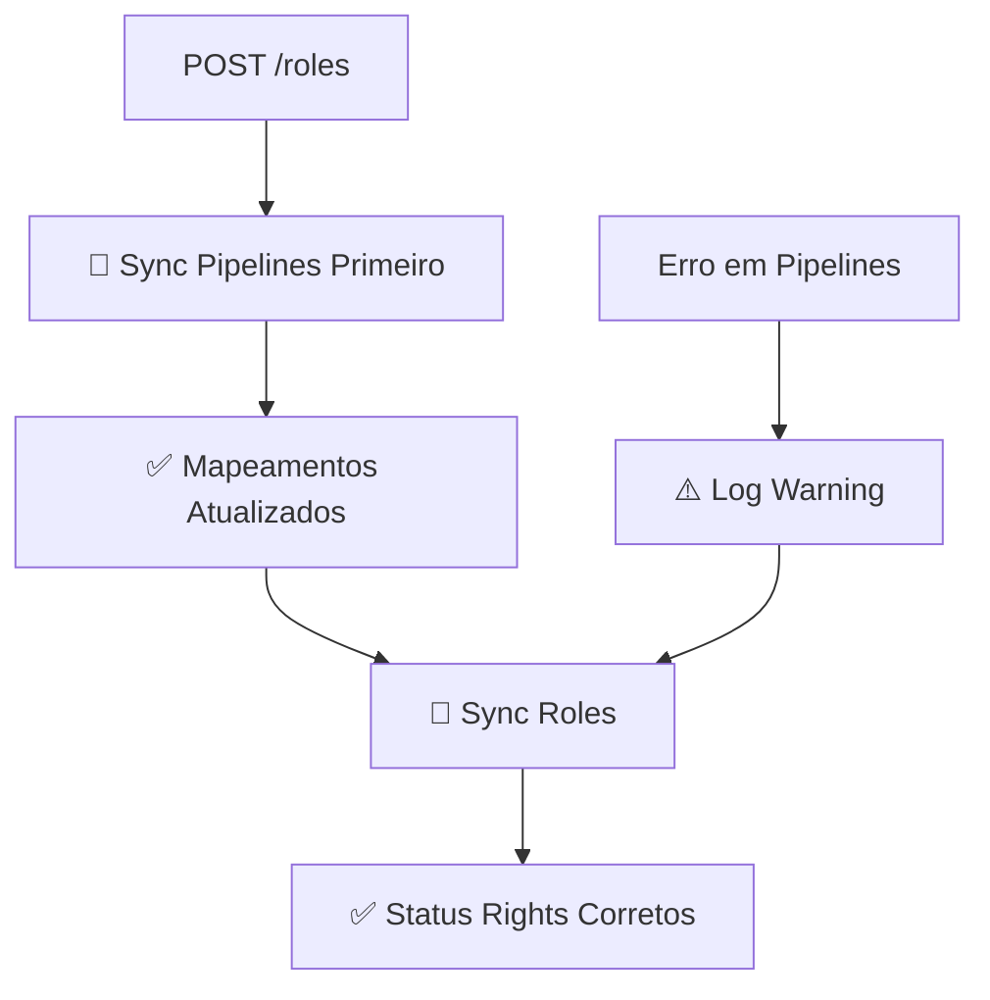

# 🔧 ROLES COM SINCRONIZAÇÃO AUTOMÁTICA DE PIPELINES

## ✅ Implementado

### 📍 **Endpoint `/api/sync/roles`**

- ✅ **Auto-sincroniza pipelines primeiro** para garantir mapeamentos atualizados
- ✅ **Depois sincroniza roles** com mapeamentos corretos
- ✅ **Tratamento de erros** - continua mesmo se pipelines falharem
- ✅ **Logs detalhados** para debugging

### 📍 **Endpoint `/api/sync/account/{id}` com `sync_type: "roles"`**

- ✅ **Mesma funcionalidade** para sincronização individual
- ✅ **Auto-sincroniza pipelines primeiro**
- ✅ **Logs informativos**

## 🔄 **Fluxo de Execução**



## 📋 **Exemplo de Logs**

```
🔧 Sincronizando pipelines primeiro para conta testedev.kommo.com (garantindo mapeamentos atualizados)...
✅ Pipelines sincronizadas para testedev.kommo.com: 2 criadas, 1 atualizadas
🔐 Sincronizando roles para conta testedev.kommo.com...
📊 Role 'ROLE 1': 5 status_rights mapeados de 9 originais
✅ Validação concluída: 5 de 5 status_rights são válidos
✅ Role 'ROLE 1' atualizada com sucesso
```

## 🎯 **Problema Resolvido**

**ANTES:**

```
❌ Status 63288851 não encontrado nos mapeamentos - pulando
🚨 MAPEAMENTOS DESATUALIZADOS DETECTADOS!
❌ Status not found (HTTP 400)
```

**DEPOIS:**

```
🔧 Sincronizando pipelines primeiro...
✅ Mapeamentos atualizados
✅ Status right mapeado: pipeline 7829791->11629591, status 63288851->89317579
✅ Role atualizada com sucesso
```

## 🚀 **Como Usar**

### Sincronização de Todas as Roles

```bash
POST /api/sync/roles
{
  "batch_config": {
    "batch_size": 5,
    "batch_delay": 1.0
  }
}
```

### Sincronização de Role de Uma Conta Específica

```bash
POST /api/sync/account/{account_id}
{
  "sync_type": "roles"
}
```

## 🧪 **Testar**

```bash
# Teste automatizado
python test_roles_with_pipelines.py

# Ou manualmente via curl
curl -X POST http://localhost:5000/api/sync/roles \
  -H "Content-Type: application/json" \
  -d '{}'
```

## ✅ **Benefícios**

1. **🔄 Automático** - Não precisa lembrar de sincronizar pipelines antes
2. **🛡️ Confiável** - Sempre usa mapeamentos atualizados
3. **🚀 Simples** - Um único endpoint resolve tudo
4. **🔍 Transparente** - Logs claros do processo
5. **⚡ Eficiente** - Só sincroniza pipelines quando necessário

**Agora o endpoint `/roles` é completamente self-sufficient! 🎯**
